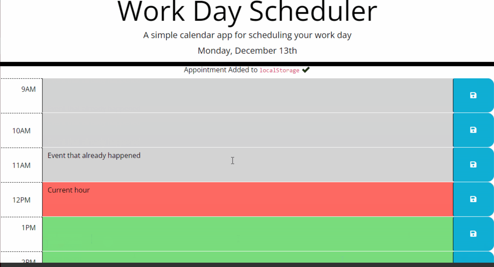

# Work Day Scheduler

A simple calendar application that allows a user to save events for each hour of the day. This app runs in the browser and feature dynamically updated HTML and CSS powered by jQuery.

**Deployed Site: [Generator](https://armandosjunior.github.io/Password-Generator/)**

---

### **Some Technical Features Include:**
```
- User is presented with time blocks of standard business hours

- Insert events by clicking on selected time block

- Blocks are color-coded to indicate whether it is in the past, present, or future

- Application displays current time & date
```
---

### **Application Mock Up:**


---
### **Technology used:**
```
- Javascript
- Jquery
- Third Party API (moment.js)
```

---

### **Steps for future development:**
```
- save time block in local storage
```
